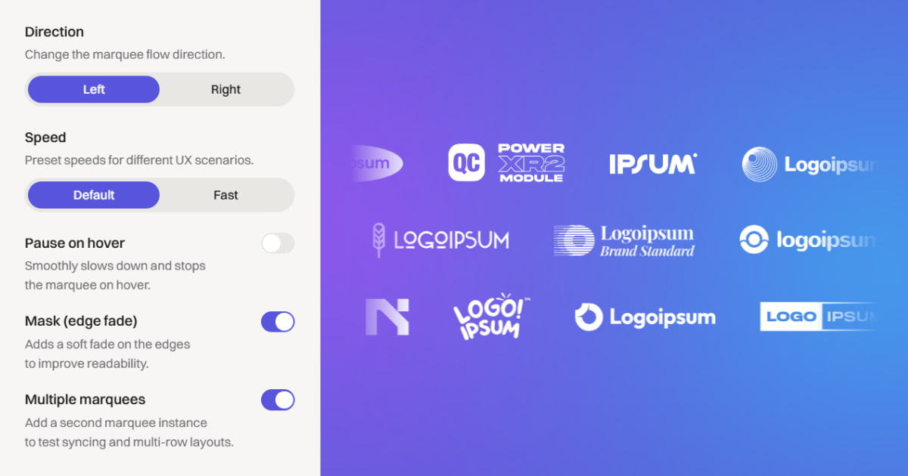

# broMarquee — Interactive Logo Marquee for Webflow

A free, lightweight, dependency-free JavaScript library for building smooth, infinite logo marquees in Webflow — with real user control (drag, wheel, touch, inertia).

**Website / Docs:** https://marquee.bro-design.pro/  
**Get started guide:** https://marquee.bro-design.pro/#how-to-use  
**FAQ:** https://marquee.bro-design.pro/#faq  
**License:** MIT

---

## Contact & support

For feedback, bug reports, or questions about broMarquee, use the Contributing section on the website:  
https://marquee.bro-design.pro/#contributing

Or reach out directly:
- **Email:** dima@bro-design.pro  
- **LinkedIn:** https://www.linkedin.com/in/tregubov-design/  
- **Upwork:** https://www.upwork.com/freelancers/~01487404f5d05a60dd  

---

## License

Released under the **MIT License**.
